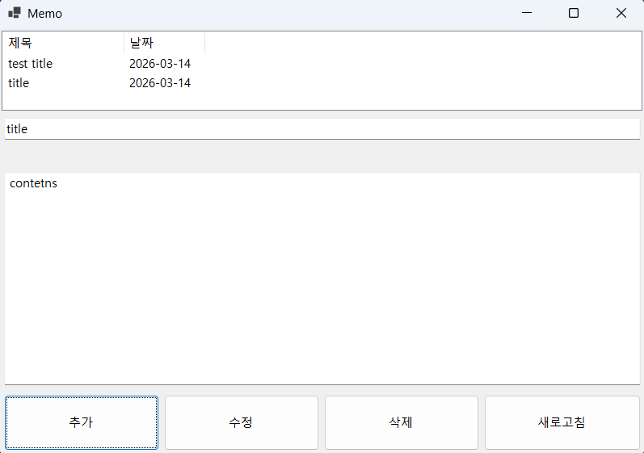
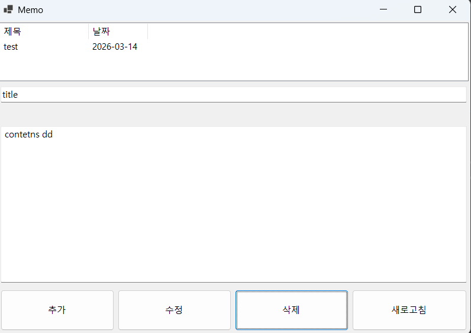
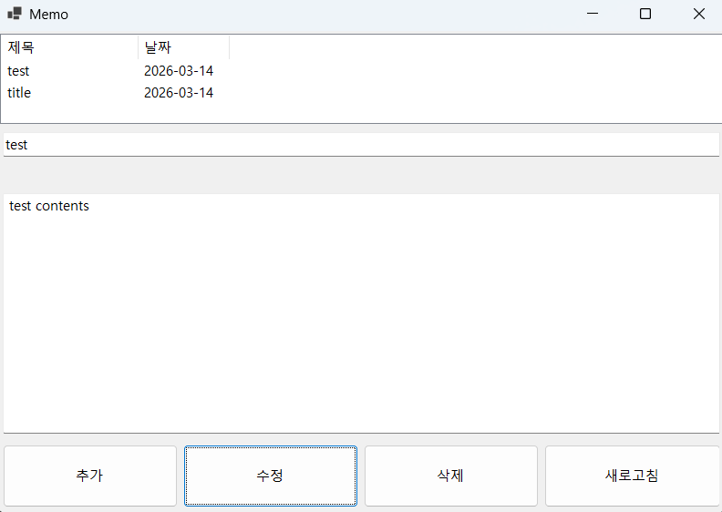

# 🪟 week2-winforms-crud

> WinForms + SQLite 기반 메모 관리 데스크톱 앱 — 재학습 커리큘럼 2주차

[](https://dotnet.microsoft.com/)
[]()
[](https://www.sqlite.org/)
[]()

---


## 📌 프로젝트 개요

3-Tier 구조(UI / Business Layer / Data Access Layer)를 직접 설계하고,
**WinForms + ADO.NET + SQLite** 조합으로 동작하는 메모 관리 앱을 구현했습니다.
CRUD 전체 흐름과 비동기 UI 처리를 실무에 가까운 방식으로 복습했습니다.

---

## 🖥️ 스크린샷




> **실행 예시**
> - 메모 목록이 ListView에 표시
> - 제목/내용 입력 후 저장 버튼 클릭 시 DB에 즉시 반영
> - 선택 항목 수정 및 삭제 가능

---

## 🗂️ 파일 구조

```
week2-winforms-crud/
├── UI/
│   ├── MainForm.cs            # 메인 폼 (이벤트 핸들러)
│   └── MainForm.Designer.cs   # 폼 디자이너 자동 생성 파일
├── BL/
│   └── MemoService.cs         # 비즈니스 로직 (유효성 검사 등)
├── DAL/
│   ├── MemoRepository.cs      # DB CRUD 메서드
├── Models/
│   └── Memo.cs                # 데이터 모델
└── README.md
```

---

## 🛠️ 기술 스택

| 항목 | 내용 |
|------|------|
| 언어 | C# 11.0 |
| 프레임워크 | .NET 8.0 Windows Forms |
| 데이터베이스 | SQLite 3 (Microsoft.Data.Sqlite) |
| 아키텍처 | 3-Tier (UI / BL / DAL) |
| 개발 환경 | Visual Studio 2022 |

---

## ⚙️ 핵심 구현 내용

### 3-Tier 아키텍처

```
MainForm (UI)
    │  이벤트 발생
    ▼
NoteService (BL)       ← 유효성 검사, 비즈니스 규칙
    │  데이터 요청
    ▼
NoteRepository (DAL)   ← SQL 실행, DB 연결
    │
    ▼
SQLite DB
```

---

### CRUD 구현

| 기능 | 메서드 | HTTP 유사 개념 |
|------|--------|--------------|
| 전체 조회 | `GetAllMemos()` | GET |
| 단건 조회 | `GetMemoById(int id)` | GET /{id} |
| 생성 | `InsertMemo(Memo memo)` | POST |
| 수정 | `UpdateMemo(Memo memo)` | PUT |
| 삭제 | `DeleteMemo(int id)` | DELETE |

---

### 유효성 검사 (MemoService)

```csharp
public bool InsertMemo(Memo memo)
{
    if (memo == null && string.IsNullOrWhiteSpace(memo.Title))
    {
        return false;
    }

    return memoRepository.InsertMemo(memo);
}
```

---

### SQL 파라미터 바인딩 (SQL Injection 방지)

```csharp
// ❌ 문자열 직접 삽입 (위험)
$"INSERT INTO Notes VALUES('{title}', '{content}')"

// ✅ 파라미터 바인딩 (안전)
cmd.Parameters.AddWithValue("@title", note.Title);
cmd.Parameters.AddWithValue("@content", note.Content);
```

---

## 🛢️ DB 스키마

```sql
CREATE TABLE IF NOT EXISTS Memo (
    Id      INTEGER PRIMARY KEY AUTOINCREMENT,
    Title   TEXT    NOT NULL,
    Content TEXT    NOT NULL,
    Date    TEXT
);
```

---

## ▶️ 실행 방법

```bash
# 저장소 클론
git clone https://github.com/[YOUR_USERNAME]/week2-winforms-crud.git
cd week2-winforms-crud

# NuGet 패키지 복원
dotnet restore

# 빌드 및 실행
dotnet run
```

> **요구 사항**
> - Windows OS (WinForms는 Windows 전용)
> - .NET 8.0 SDK 이상
> - Visual Studio 2022 권장

---

## 💡 트러블슈팅

<!-- 실제 겪은 문제를 작성하세요. 면접 단골 질문입니다. --> 

**문제:** Model에서 접근 제한자(access modifier)를 습관적으로 private로 설정하여 외부에서 해당 필드/메서드에 접근할 수 없는 문제가 발생 

**해결:** 접근이 필요한 부분에 대해 접근 제한자를 public으로 수정하여 정상적으로 접근 가능하도록 변경

---

**문제:** ListBox에 List 변수를 단순이 DataSource를 사용하여 담으면 화면에 class 경로가 표시, class의 여러 변수를 표시하지 못 함

**해결:** ListView를 사용하는 방식으로 변경

---

## 📅 학습 기간

- 시작일: `2026-03-13`
- 완료일: `2026-03-14`

---

## 🔗 관련 링크

- [이전 단계 ← week1-csharp-basics](../week1-csharp-basics)
- [다음 단계 → week3-aspnet-api](../week3-aspnet-api)
- [커리큘럼 전체 보기](../README.md)